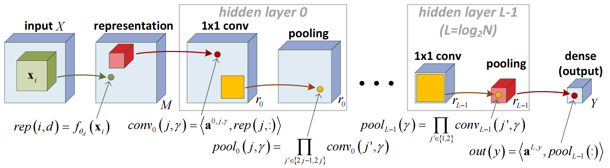
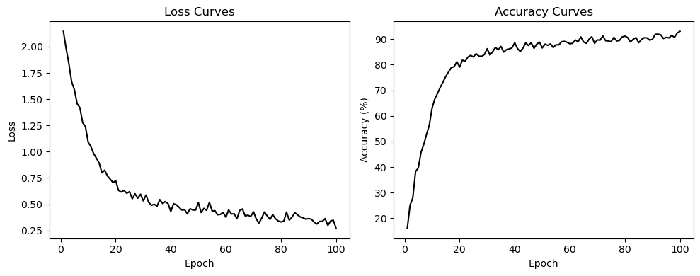

# MyTorch: A Deep Learning Library from Scratch
This project is inspired by **PyTorch**. Its motivation is to build and train the Hierarchical Tucker (HT) model, proposed in the paper ["On the Expressive Power of Deep Learning: A Tensor Analysis"](https://arxiv.org/abs/1509.05009), without relying on any external deep learning framework.

## 📘 Description
The primary goal of **MyTorch** is to develop an automatic differentiation system to realize [backpropagation](https://www.iro.umontreal.ca/~vincentp/ift3395/lectures/backprop_old.pdf), the key algorithm underlying model training. Each file in the `mytorch/` directory serves a specific purpose as outlined below:
- `tensor.py`: Defines the custom `Tensor` class, the core data structure resembling `torch.Tensor`.
- `operations.py`: Defines low-level operations for `float`.
- `arithmetics.py`: Implements high-level arithmetics for `Tensor`, adapted to support automatic differentiation.
- `losses.py`: Contains various loss functions used for different training tasks.
- `optimizers.py`: Implements common optimization algorithms such as stochastic gradient descent and Adam optimizer.
- `models.py`: Stores common deep learning models, including multilayer perceptron (MLP) and convolutional neural network (CNN).
- `train.py`: Provides simple custom datasets and functions for training and visualizing model performance.
- `utils.py`: Includes auxiliary utility functions used across the project.
- `HT.py`: Implements the HT model and its training function.

For comprehensive mathematical derivations, illustrations, visualizations and references, please check `report.ipynb`.

## 📈 Visuals
The following diagram illustrates the structure of the HT model:

*Figure 1: Hierarchical Tucker (HT) model by [Cohen et al. (2016)](https://arxiv.org/abs/1509.05009).*

We trained the HT model on a subset of [**MNIST**](https://en.wikipedia.org/wiki/MNIST_database) dataset. The resulting training curves are shown below:

*Figure 2: Training curves of the HT model on MNIST dataset.*

## 👨‍💻 Author
**Yangshan Xiang**  
Email: yangshan.xiang@stud.uni-goettingen.de

## 🙏 Acknowledgment
This project was developed as part of the **Scientific Computing Practical** course at the **University of Göttingen** under the supervision of **Dr. Igor Voulis** and **Prof. Dr. Max Pfeffer**. Special thanks to **Abdul Halim** for his patient guidance.